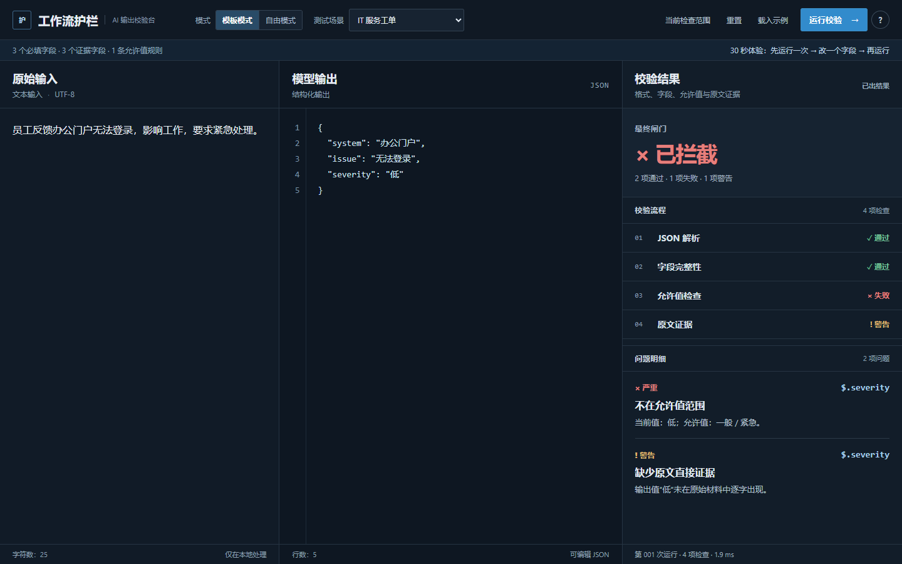

# Enterprise AI Workflow Lab

**AI 输出看起来像 JSON，不代表它已经适合进入下游系统。**

**[立即体验 Live Demo](https://alex-996-me.github.io/enterprise-ai-workflow-lab/)**

## 30 秒上手

选择“IT 服务工单” → 点击“运行校验” → 把 `severity` 从“紧急”改成“低” → 再运行一次。

## Workflow Guardrail

一个公开、脱敏的 AI 结构化输出校验工具。它不是第二个 AI。**它不是帮 AI 做决定，而是在 AI 做完决定以后，检查这份输出有没有资格继续往下走。**

四项检查分别回答：JSON 是否可解析、要求的字段是否齐全、指定值是否在允许范围、关键值是否在原文中直接出现。结果为“已拦截”“需要人工复核”或“可进入人工复核”；最后一种状态仍需要人判断事实和业务适用性。查看 [中文快速说明](docs/QUICKSTART_CN.md)。

## 使用自己的输入

切换到“自由模式”，编辑预填的蓝牙耳机案例或换成自己的顶层 JSON。打开“校验配置”选择要检查的字段和允许值；所有输入仅在浏览器本地处理，不上传服务器。

## 项目来源与边界

本项目是实习结束后，基于企业 AI 工作流调研中发现的通用问题进一步完成的**公开、脱敏成果转化**。所有案例与规则均为虚构；它不是公司内部系统，也不是实习期间交付的工具。

页面使用 HTML、CSS 和 Vanilla JavaScript，无需登录、后端、API Key 或真实 LLM。当前只支持顶层 JSON 字段、单字段允许值和原文逐字匹配，不做语义推理或自动事实核查。
