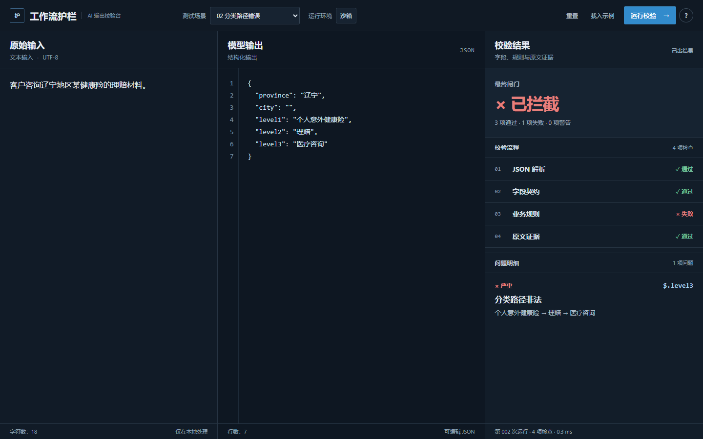

# Enterprise AI Workflow Lab

> 一个公开、脱敏的企业 AI 输出校验实验项目。

## Workflow Guardrail

**AI 结构化输出校验台** · [Live Demo](https://alex-996-me.github.io/enterprise-ai-workflow-lab/) · [Repository](https://github.com/Alex-996-me/enterprise-ai-workflow-lab)

模型输出具有结构化外观，并不意味着内容已经满足下游系统的可靠性要求。这个可交互 Demo 让你输入原始材料和模拟的 AI JSON 输出，观察哪些检查通过、哪些问题需要人工处理。

### 它能做什么

- **JSON 解析：** 检查语法及顶层对象。
- **字段契约：** 检查必填字段、字符串类型和必要的非空值。
- **业务规则：** 检查完全虚构的演示分类路径。
- **原文证据：** 检查非空地区值是否在原始材料中出现。

最终闸门显示**已拦截**、**需要人工复核**或**可进入人工复核**。最后一种状态只表示这些演示检查未发现阻断项，仍需人判断。

### 为什么做

本项目源于本人 2026 年企业 AI workflow 实习调研中形成的一个认识：模型输出看起来像结构化数据，不代表它已经可靠。**实习结束后**，我将这一通用问题进一步抽象为公开、脱敏的浏览器工具；它不是实习期间开发的公司系统。

### 如何使用

打开 [Live Demo](https://alex-996-me.github.io/enterprise-ai-workflow-lab/)，选择测试场景或自行编辑两段输入，点击“运行校验”，查看校验流程、问题明细和最终闸门。无需安装、登录或 API Key；输入只在浏览器本地处理，不上传服务器。

流程：原始材料 + 模拟 AI 输出 → JSON Parse → Schema Contract → Business Rules → Evidence Match → Human Review Gate。

### 公开边界与限制

- 所有公开案例和分类树均为虚构；不包含真实客户材料、公司内部 workflow、原始 Prompt、内部 API／IP 或系统配置。
- 原文证据检查只是字面匹配，不做语义推理或事实验证。
- 分类路径不代表真实保险业务规则；本工具不是生产规则引擎、公司内部系统或自动业务决策工具。

### Quick Access

扫描二维码打开 [Live Demo](https://alex-996-me.github.io/enterprise-ai-workflow-lab/)：

Developed by 栗海粟 as a post-internship, de-identified follow-up project.
